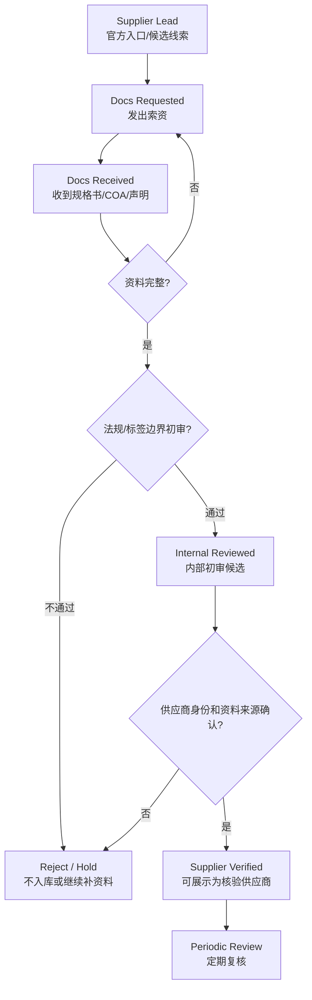

# Supplier Verified Intake Template v1 — 供应商入驻 / 索资 / 审核模板

> 日期：2026-06-03
> 状态：template / internal use
> 目标：把“供应商线索”与“平台已核验供应商”分开，避免 Public Evidence 被误用为 Supplier Verified。

## 1. 分层定义

| 层级 | 含义 | 可用于 AI 输出吗 | 可用于供应商推荐吗 |
|---|---|---:|---:|
| Public Evidence | 官方法规、国家标准、公开资料、供应商官网公开页 | 可作为合规/资料边界提示 | 不可 |
| Supplier Lead | 真实公司和官方联系入口，但尚未索资 | 只能提示“可索资方向” | 不可 |
| Docs Requested | 已发出索资请求，等待资料 | 不可作为已核验推荐 | 不可 |
| Docs Received | 已收到规格书、COA、声明等资料 | 可供内部审阅 | 不可，除非通过审核 |
| Internal Reviewed | 平台已完成初审，但仍需定期复核 | 可作为候选推荐，需标注边界 | 可谨慎展示 |
| Supplier Verified | 资料齐全、来源确认、法规/标签边界初审通过 | 可展示为已核验供应商 | 可 |

## 2. 审核状态枚举

```json
{
  "lead_only": "仅线索，只有官方入口或公开资料",
  "docs_requested": "已向供应商索取资料",
  "docs_received": "已收到资料，未完成平台审核",
  "internal_reviewed": "平台内部初审通过，仍需周期复核",
  "supplier_verified": "资料齐全且通过供应商核验"
}
```

硬规则：

- `lead_only`、`docs_requested`、`docs_received` 不得在用户侧显示为“已验证供应商”。
- `supplier_verified` 必须有资料文件、来源、审核人、审核日期和复核周期。
- Public Evidence 卡不得自动升级任何供应商状态。

## 3. 入驻 / 索资表单字段

### 3.1 公司信息

| 字段 | 必填 | 说明 |
|---|---:|---|
| company_name_cn | 是 | 公司中文名；境外公司可为空但需保留英文名 |
| company_name_en | 是 | 公司英文名或法定主体名 |
| business_registration_region | 是 | 注册地 / 国家 / 地区 |
| official_website | 是 | 官网 |
| official_contact_url | 是 | 官方联系页或表单 |
| contact_person | 否 | 联系人姓名 |
| contact_role | 否 | 职位 |
| contact_email | 否 | 邮箱，禁止写入公开仓库 |
| contact_phone | 否 | 电话，禁止写入公开仓库 |
| china_entity_or_distributor | 否 | 中国主体或代理信息 |

### 3.2 产品信息

| 字段 | 必填 | 说明 |
|---|---:|---|
| product_name | 是 | 产品名 / 商品名 |
| ingredient_name | 是 | 对应原料通用名 |
| ingredient_aliases | 否 | 别名、英文名、CAS 等 |
| product_grade | 是 | 食品级、营养品级、药品级等；平台优先食品级 |
| product_form | 是 | 粉末、油剂、微囊粉、液体、颗粒等 |
| active_content | 是 | 有效成分含量或核心指标 |
| carrier_or_excipients | 否 | 载体、辅料、包埋材料 |
| target_applications | 是 | 目标剂型和应用场景 |
| recommended_dosage | 否 | 供应商建议用量；必须经法规复核 |
| shelf_life | 否 | 保质期 |
| storage_conditions | 否 | 储存条件 |

### 3.3 质量和文件资料

| 字段 | 必填 | 说明 |
|---|---:|---|
| tds_or_spec_sheet | 是 | 规格书 / TDS 文件 |
| coa_sample | 是 | COA 或 COA 样例 |
| test_report | 条件必填 | 重金属、农残、微生物、溶剂残留等 |
| allergen_statement | 是 | 过敏原声明 |
| non_gmo_statement | 否 | 如产品宣称非转基因则必填 |
| halal_kosher_cert | 否 | 如用于特定渠道则必填 |
| origin_statement | 否 | 原产地声明 |
| food_grade_statement | 是 | 食品级声明 |
| contaminants_limits | 是 | 关键污染物限量或检测项 |
| stability_data | 条件必填 | 饮料、软糖、益生菌、油脂等剂型需提供 |

### 3.4 法规和标签资料

| 字段 | 必填 | 说明 |
|---|---:|---|
| regulatory_path_claimed_by_supplier | 是 | 供应商主张的法规路径 |
| applicable_food_categories | 是 | 适用食品类别 |
| china_regulatory_support | 条件必填 | 中国市场销售或入库必须补充 |
| unsuitable_population | 是 | 不适宜人群 |
| mandatory_label_warnings | 是 | 必须标识内容 |
| suggested_label_language | 否 | 供应商建议话术，仅作参考 |
| prohibited_or_risky_claims | 是 | 禁用 / 高风险表达 |
| max_use_level_or_basis | 条件必填 | 涉及限量或营养强化剂时必填 |
| public_evidence_refs | 是 | 对应 Public Evidence 卡 / 法规来源 |
| manual_review_notes | 是 | 人工复核记录 |

### 3.5 商务和样品信息

| 字段 | 必填 | 说明 |
|---|---:|---|
| moq | 否 | 最小起订量 |
| sample_policy | 否 | 样品政策 |
| lead_time | 否 | 交期 |
| price_range | 否 | 价格区间，禁止公开展示未经授权报价 |
| supply_region | 是 | 可供货区域 |
| distributor_info | 否 | 国内代理或经销商 |
| payment_terms | 否 | 付款条件 |
| after_sales_support | 否 | 技术支持、应用支持 |

## 4. 推荐 JSON 草案结构

> 仅作未来后台或内部数据格式参考；不要把未审核资料直接写入运行数据。

```json
{
  "supplier_id": "sup_xxx",
  "status": "lead_only",
  "company": {
    "name_cn": "",
    "name_en": "",
    "website": "",
    "official_contact_url": "",
    "china_entity_or_distributor": ""
  },
  "product": {
    "name": "",
    "ingredient_name": "",
    "aliases": [],
    "grade": "food_grade",
    "form": "powder",
    "active_content": "",
    "target_applications": [],
    "recommended_dosage": ""
  },
  "documents": {
    "spec_sheet": "requested",
    "coa": "requested",
    "test_report": "requested",
    "food_grade_statement": "requested",
    "allergen_statement": "requested"
  },
  "regulatory_review": {
    "public_evidence_refs": [],
    "applicable_food_categories": [],
    "risky_claims": [],
    "manual_review_required": true,
    "reviewed_by": "",
    "reviewed_at": ""
  },
  "commercial": {
    "moq": "",
    "sample_policy": "",
    "lead_time": "",
    "supply_region": ""
  },
  "audit_log": [
    {
      "status": "lead_only",
      "changed_at": "2026-06-03",
      "changed_by": "00-main",
      "note": "Created from official public contact entry; not supplier verified."
    }
  ]
}
```

## 5. 审核流程



## 6. 必须人工复核的情形

以下场景即使资料齐全，也必须人工复核后才能进入用户侧推荐：

- 儿童、婴幼儿、特膳；
- 新食品原料、营养强化剂、食品添加剂边界不清；
- 保健食品、疾病风险降低、辅助降血脂、增强免疫力等方向；
- 护眼、抗衰、抗疲劳、减肥/燃脂、解酒/护肝、改善睡眠；
- 益生菌菌株身份不清，或只有商品名没有 strain level；
- 植物提取物缺少食品级资质或中国适用路径；
- 供应商建议标签语带有医疗、治疗或夸大功效暗示。

## 7. 对 AI 输出的约束

当某原料只有 Public Evidence 或 Supplier Lead 时，AI 应表达：

- “当前仅有公开证据 / 供应商线索，尚未完成平台供应商核验。”
- “供应商部分建议作为索资方向，不代表平台已有可采购供应商。”
- “用量、食品类别、标签表达和供应商资料需人工复核。”

不得表达：

- “平台已验证该供应商”；
- “已完成索资”；
- “可直接采购”；
- “合规无风险”；
- “官方确认可用于所有普通食品”。

## 8. 文件命名建议

收到真实资料后，建议内部资料按以下命名，不提交到公开仓库：

```text
YYYY-MM-DD_supplier_product_doc-type_confidential.pdf
YYYY-MM-DD_supplier_product_coa-sample_confidential.pdf
YYYY-MM-DD_supplier_product_review-notes_internal.md
```

公开仓库只保留脱敏后的索引和审核状态，不保留报价、联系人手机号、未授权资料全文。
